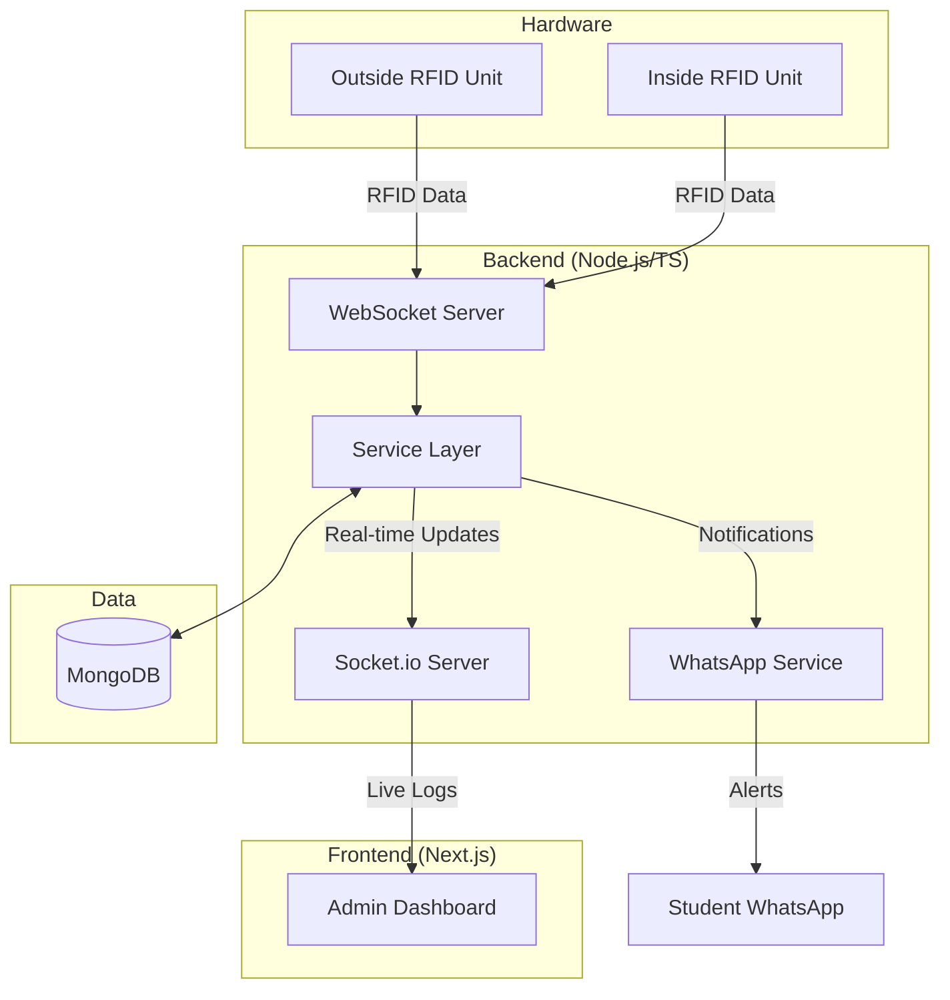

# 🎓 Attenza: Smart Attendance System

[](https://nextjs.org/)
[](https://www.typescriptlang.org/)
[](https://www.mongodb.com/)
[](https://socket.io/)

**Attenza** is a real-time, hardware-integrated student attendance management system. It leverages RFID technology for seamless check-ins and automated WhatsApp notifications to keep students informed about teacher arrivals, class timings, and attendance status.

---

## 🚀 Key Features

-   **Real-time RFID Integration**: Instant attendance marking via ESP8266-based RFID readers.
-   **Dual-Device Context**: Specialized logic for "Inside" and "Outside" classroom units to track movement and early check-ins.
-   **Smart WhatsApp Alerts**: Automated notifications for teacher arrivals, late entries, and break warnings using highly attractive templates.
-   **Dynamic System Configuration**: Admin dashboard to configure grace periods, operating hours, and attendance policies without code changes.
-   **Comprehensive Dashboard**: Real-time analytics, student tracking, and timetable management for administrators.
-   **Points System**: Gamified attendance with points awarded for punctuality.

---

## 🛠️ Tech Stack

**Frontend:**
- [Next.js 14](https://nextjs.org/) (App Router)
- [Tailwind CSS](https://tailwindcss.com/) & [shadcn/ui](https://ui.shadcn.com/)
- [Lucide React](https://lucide.dev/) for iconography

**Backend:**
- [Node.js](https://nodejs.org/) & TypeScript
- [Socket.io](https://socket.io/) for real-time dashboard updates
- [WebSocket (ws)](https://github.com/websockets/ws) for hardware communication
- [MongoDB](https://www.mongodb.com/) for persistent storage
- [Baileys](https://github.com/WhiskeySockets/Baileys) for WhatsApp integration

**Hardware:**
- ESP8266 / NodeMCU
- RC522 RFID Module

---

## 📐 System Architecture

### Communication Flow


### System Lifecycle & Modes
The system operates in distinct modes managed by a centralized `ModeManager`, dictating classroom accessibility and automated alerts.

- **CLOSED**: Outside operating hours (Hardware rejects scans).
- **EARLY_ACCESS**: 30m before first class (Allows entry without attendance).
- **IDLE**: No active class (Movement tracking only).
- **SLOT_ACTIVE**: Teacher arrival triggers attendance and alerts.
- **BREAK**: Scheduled gaps between classes with end-of-break buzzers.

---

## 🧠 Core Logic & Algorithms

### A. Student Attendance Flow
1. **Scenario 1: Standard Entry**: Tapping during an active class marks the student **PRESENT** (within grace period) or **LATE** (+ points awarded).
2. **Scenario 2: Early Bird**: Tapping before class starts proactively marks attendance for the upcoming slot.
3. **Scenario 3: Re-verification**: During class-to-class transitions, students use the **Inside Unit** to verify continued presence.

### B. Teacher Arrival (The System Heartbeat)
When a teacher scans their ID:
- An **Active Session** is initialized in MongoDB.
- A **Snapshot** is taken of all students already physically in the room.
- **WhatsApp Alerts** are automatically sent to missing students: *"Teacher has arrived in {Room}! Scan now to avoid being marked late."*

---

## 🚦 Getting Started

### Prerequisites

-   Node.js 18+
-   MongoDB Instance (Local or Atlas)
-   Arduino IDE (for hardware deployment)

### 1. Server Setup

1.  Clone the repository:
    ```bash
    git clone https://github.com/DeAlexanderRosario/attenza.git
    cd attenza
    ```
2.  Install dependencies:
    ```bash
    npm install
    ```
3.  Configure Environment Variables:
    Create a `.env` file in the root:
    ```env
    MONGODB_URI=your_mongodb_connection_string
    NEXT_PUBLIC_APP_URL=http://localhost:3000
    SOCKET_PORT=3001
    ```
4.  Run the production server:
    ```bash
    npm run dev
    ```
5.  Start the Socket Server (Hardware Gateway):
    ```bash
    npx ts-node socket-server.ts
    ```

### 2. Hardware Setup

1.  Navigate to `hardware/esp8266_rfid/`.
2.  Open `esp8266_rfid.ino` in Arduino IDE.
3.  Configure your WiFi credentials and Server WebSocket URL.
4.  Upload to your ESP8266 device.

---

## ⚙️ Configuration

The system behavior can be managed via the **Admin Dashboard > Settings** page:
-   **Teacher Grace Period**: Time allowed for teachers to arrive before a slot is auto-cancelled.
-   **Entry Windows**: Punctuality thresholds for "Present" vs "Late" status.
-   **Operating Hours**: Start and end times for the entire system.
-   **Break Warnings**: Timing for pre-end-of-break alerts.

---

## 🛡️ License

Distributed under the MIT License. See `LICENSE` for more information.

---

<p align="center">
  Made with ❤️ by the Attenza Team
</p>
