<p align="center">
  
</p>

# <p align="center">🎓 Attenza: Smart Attendance System</p>

<p align="center">
  <strong>A premium, real-time attendance management ecosystem powered by RFID and WhatsApp.</strong>
</p>

<p align="center">
  
  
  
  
</p>

---

> [!IMPORTANT]
> **Project Submission**: This project is submitted as a mini project by a 3rd-year B.Tech student of the Electronics and Communication Engineering Department, **AISAT Engineering College**.

**Attenza** is a state-of-the-art, hardware-integrated student attendance management system. Designed for precision and ease of use, it leverages RFID technology for seamless check-ins and automated WhatsApp notifications to keep students informed in real-time.

---

## ✨ Key Features

| Feature | Description |
| :--- | :--- |
| 🛡️ **RFID Integration** | Instant attendance marking via ESP8266-based RFID readers. |
| 📍 **Dual-Device Context** | Specialized "Inside" and "Outside" logic to track physical presence and early check-ins. |
| 📱 **Smart WhatsApp Alerts** | Automated notifications for teacher arrivals, late entries, and class updates. |
| ⚙️ **Dynamic Config** | Admin dashboard to configure grace periods and attendance policies on the fly. |
| 📊 **Real-time Analytics** | Live dashboard updates using Socket.io for monitoring classroom activity. |
| 🏆 **Points System** | Gamified attendance tracking to reward punctuality and consistency. |

---

## 🏗️ System Architecture

```mermaid
flowchart TD
    subgraph Hardware ["📡 Hardware Layer"]
        A["Outside RFID Unit"]
        B["Inside RFID Unit"]
    end

    subgraph Backend ["⚡ Backend (Node.js/TS)"]
        C["WebSocket Server"]
        D["Service Layer (Attendance/Slots)"]
        E["WhatsApp Notification Service"]
        F["Socket.io (Real-time Broadcaster)"]
    end

    subgraph Data ["💾 Data Persistence"]
        G[("MongoDB Atlas")]
    end

    subgraph Frontend ["🎨 Frontend (Next.js)"]
        H["Admin Dashboard"]
        I["Live Activity Log"]
    end

    A & B -->|RFID Data| C
    C --> D
    D <--> G
    D -->|Alerts| E
    D -->|Live Data| F
    F -->|Updates| I
    E -->|WhatsApp| J["Student Mobile"]
```

<details>
<summary><b>Click to expand Architecture Details</b></summary>


</details>

---

## 🛠️ How it Works

1.  **Teacher Check-In**: A teacher scans their RFID card at the classroom door.
2.  **Session Activation**: The system initializes an active class session and captures a "snapshot" of students already present.
3.  **Broadcasting Alerts**: Students not yet checked in receive an immediate WhatsApp notification: *"Teacher has arrived! Please check in now."*
4.  **Student Entry**: Students scan their cards. Depending on the timing, they are marked **Present**, **Late**, or **Early Access**.
5.  **Re-Verification**: Students use the "Inside Unit" during transitions to confirm their continued presence.

---

## 🚦 Getting Started

### Prerequisites

-   **Node.js** 18 (LTS) or higher
-   **Yarn** Package Manager
-   **MongoDB** Instance (Local or Atlas)
-   **Arduino IDE** (for hardware deployment)

### 1. Server Setup

1.  **Clone the repository**:
    ```bash
    git clone https://github.com/DeAlexanderRosario/attenza.git
    cd attenza
    ```
2.  **Install dependencies**:
    ```bash
    yarn install
    ```
3.  **Build the application**:
    ```bash
    yarn build
    ```
4.  **Environment Variables**:
    Create a `.env.local` file:
    ```env
    MONGODB_URI=your_mongodb_connection_string
    NEXT_PUBLIC_APP_URL=http://localhost:3000
    SOCKET_PORT=3001
    ```
5.  **Run Development Server**:
    ```bash
    yarn dev
    ```
6.  **Start Hardware Socket Gateway**:
    ```bash
    npx tsx socket-server.ts
    ```

---

## ⚙️ Configuration & Hardware

<details>
<summary><b>🛠️ Hardware Deployment</b></summary>

1.  Navigate to `hardware/esp8266_rfid/`.
2.  Open `esp8266_rfid.ino` in Arduino IDE.
3.  Configure WiFi credentials and Server WebSocket URL.
4.  Upload to your ESP8266 device.
</details>

<details>
<summary><b>🔧 Admin Controls</b></summary>

The **Admin Dashboard > Settings** page allows management of:
- **Grace Periods**: Time thresholds for teachers and students.
- **Operating Hours**: System-wide start/end timings.
- **Break Rules**: Configuration for gap periods and buzzers.
</details>

---

<p align="center">
  Made with 💜 by the Attenza Team<br>
  <strong>AISAT Engineering College - ECE Department</strong>
</p>
