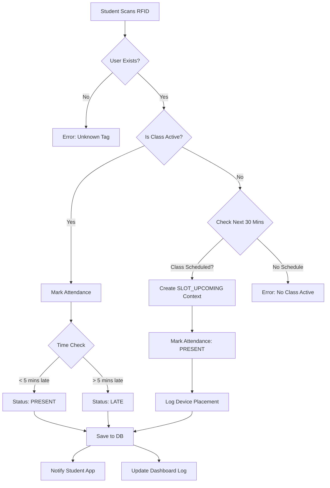
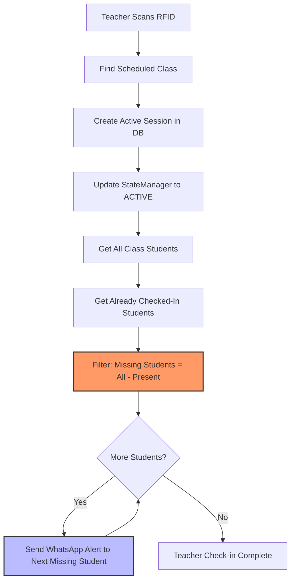
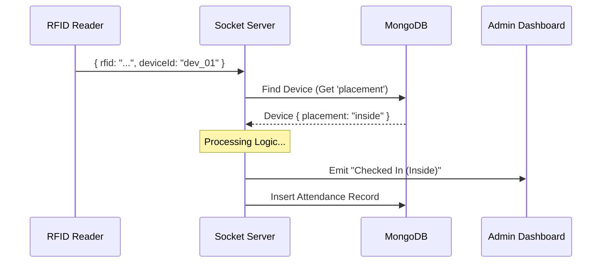

# Smart Attendance System: Flows & Algorithms

This document details the logical flows for the Attenza Smart Attendance System, including "Early Check-in", "Dual Device" features, and the complete class lifecycle timeline.

## 1. Student Attendance Flow

### Algorithm
1.  **RFID Scan**: System receives `rfidTag` and `deviceId`.
2.  **User Verification**: Looks up user. If not found -> Error.
3.  **Active Slot Check**:
    *   Query `StateManager` for an active class in this room.
    *   **IF Active Slot Found**:
        *   Calculate points/status based on arrival time (Standard Logic).
        *   Mark Attendance in DB.
    *   **IF NO Active Slot** (Early Check-in / Break Logic):
        *   **Lookahead**: Check `SlotService` for a scheduled class for this student's class ID within the next **30 minutes**.
        *   **IF Upcoming Slot Found**:
            *   Create temporary `SLOT_UPCOMING` context.
            *   Mark Attendance as **PRESENT**.
            *   Log Placement: Record if device was "Inside" or "Outside".
        *   **ELSE**: Return "No Class Active".

### Flowchart

---

## 2. Teacher Arrival & Notification Flow

### Algorithm
1.  **RFID Scan**: Teacher scans tag.
2.  **Schedule Check**: Find scheduled class for this teacher/time.
3.  **Session Creation**:
    *   Create `ActiveSession` in DB.
    *   Initialize `ActiveSlot` in Memory (Status: `SLOT_ACTIVE`).
4.  **Notification Logic (Smart Filtering)**:
    *   **Fetch All Students**: Get full list of students enrolled in this class.
    *   **Fetch Present Students**: Query `AttendanceService` for students who have *already* checked in (via Early/Break logic).
    *   **Compute Missing**: `Missing = All - Present`.
    *   **Send Alerts**: Loop through `Missing` list and send WhatsApp "Teacher has Checked In" message.
5.  **Output**: "Welcome, [Teacher Name]".

### Flowchart

---

## 3. Chronological Class Timeline

This section details the system behavior across a full class session timeline.
**Assumptions**: Class Start: 09:00, Teacher Arrives: 09:00.

| Time | Actor | Action | System Logic | Result / Notification |
| :--- | :--- | :--- | :--- | :--- |
| **08:50** | **Student A** | Taps Inside/Outside Device | No Active Class -> Checks Schedule (Looks ahead 30m). Finds 09:00 Class. | **Marked PRESENT** (Early Bird). Dashboard Logs: "Checked In (Inside/Outside)". No Notification sent yet. |
| **09:00** | **Teacher** | Taps Device | Finds Schedule -> Starts Session. **Calculates Missing Students**. | **Session STARTED**. WhatsApp "Teacher Arrived" sent to **Everyone EXCEPT Student A**. |
| **09:02** | **Student B** | Taps Outside Device | Active Class Found. `Time - TeacherArrival <= 5 mins`. | **Marked PRESENT**. Dashboard Logs: "Checked In". |
| **09:10** | **Student C** | Taps Outside Device | Active Class Found. `Time - TeacherArrival > 5 mins`. | **Marked LATE**. Dashboard Logs: "Checked In (Late)". |

---

## 4. Dual Device Context (Inside/Outside)

Active during the logging phase of all flows.

*   **Outside Device (`device_a205`)**: Standard entry point.
*   **Inside Device (`device_a206`)**:
    *   Placed inside the classroom.
    *   Used during **Break Times** (when no class is active).
    *   Triggers the "Early Check-in" path in the Student Flow.
    *   Result: Students verify presence for the *next* slot without leaving the room.

### Data Flow for Logs

